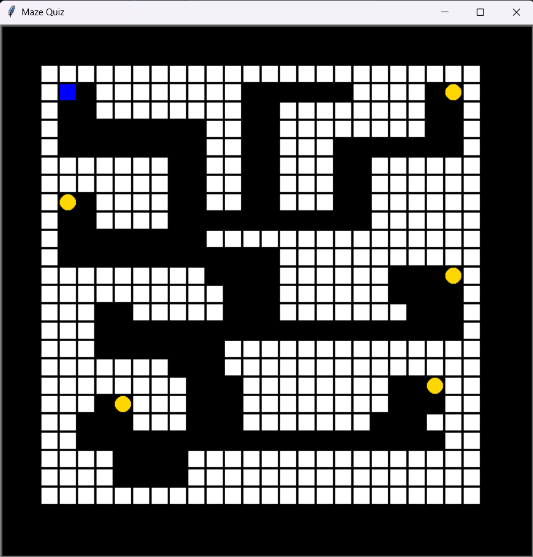
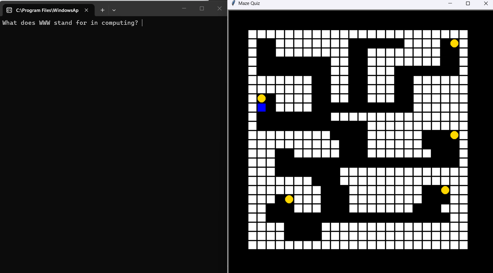
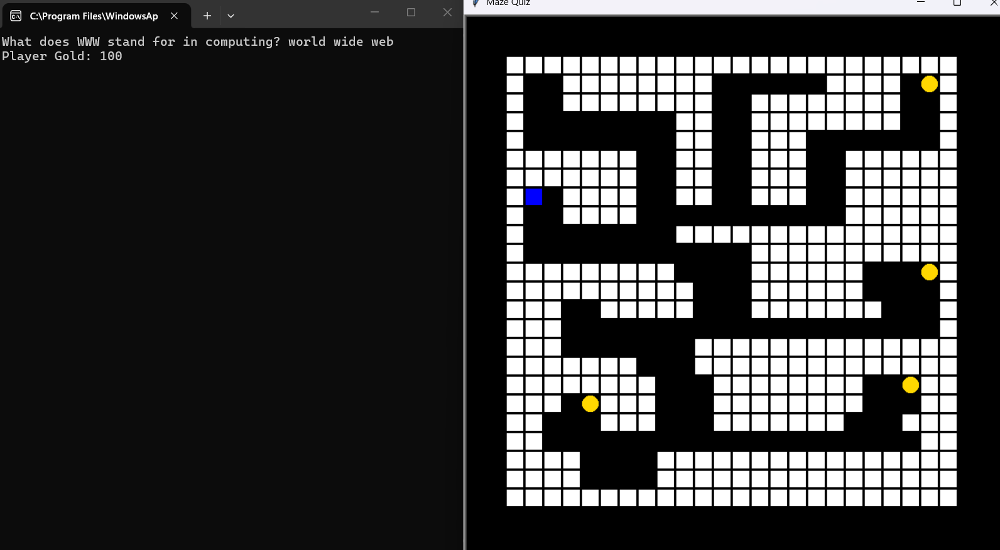

# Maze Quiz 🎮

A Python Turtle-based maze game that combines maze navigation with computer science quiz questions.

This repository contains both the **original version** of the project and an **improved version** that I revisited and developed further.

## 📌 Project Development

The original version of Maze Quiz was created as part of my studies.

I later returned to the project to review the existing code and improve the game while keeping the original concept and core gameplay.

### Original Version

`maze_quiz_original.py`

This is the original version of the project as it was initially developed.

### Improved Version

`maze_quiz_improved.py`

This version revisits the original project with improvements to the game's structure and gameplay, while keeping the original maze quiz concept.

## 🕹️ Features

* Maze navigation using the arrow keys
* Computer science quiz questions
* Coin collection
* Score system
* Three lives
* Randomised questions
* Questions are not repeated until the question list has been used
* Game-over screen
* Game completion screen
* Restart functionality

## 🎯 How to Play

1. Start the game.
2. Use the **arrow keys** to move around the maze.
3. Collect the coins.
4. Answer the computer science questions when prompted.
5. Correct answers increase your score.
6. Incorrect answers cost a life.
7. Collect all the coins to complete the maze.

## 🛠️ Technologies Used

* **Python**
* **Turtle Graphics**
* **Random module**
* **Math module**

## ▶️ How to Run

### Requirements

* Python 3.x

### Running the improved version

Open a terminal in the project folder and run:

```bash
python maze_quiz_improved.py
```

To run the original version:

```bash
python maze_quiz_original.py
```

## 📸 Screenshots

### Main Game



### Computing Quiz



### Quiz Answer and Coins



## 📚 What I Learned

This project helped me develop my understanding of:

* Python classes and objects
* Functions and variables
* Lists and dictionaries
* Keyboard input
* Collision detection
* Game loops
* Random question selection
* Managing game states
* Using the Turtle graphics library
* Revisiting and improving existing code

## 🔮 Possible Future Improvements

Some possible future improvements could include:

* Additional maze layouts
* More quiz questions
* A high-score system
* Sound effects and background music
* A graphical menu
* Different types of collectible items
* Difficulty settings
* Adding more levels
